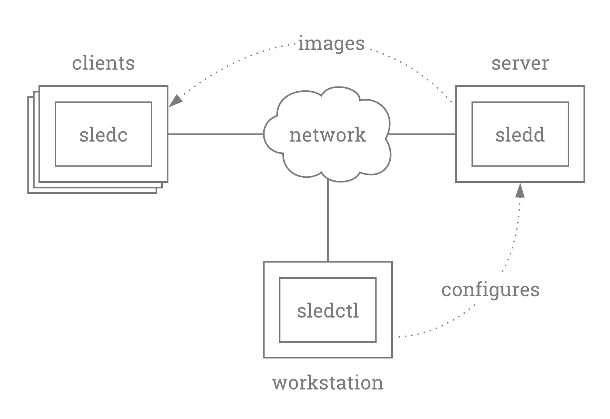

# sled - System Loader for Ephemeral Devices


sled is a system software loader designed to run in the [u-root](https://u-root.tk) initramfs. sled is designed to support loading systems onto devices that are ephemeral, for example shared devices that get reloaded with new systems for every user that uses them. The sled software consists of a client, server and API.

<p align="center"></p>


The sled client supports the following functionalities.

- device wiping
- device writing (filesystem, kernel, initramfs)
- device reloading (via kexec - into new kernel, initramfs, filesystem)

Every time the client boots it connects to the sledd server.  The sledd server, does a lookup into its database, based on the hardware address of the connecting client, for what image/system should be running on the client.  Management of thousands of devices can be manged from a single logical place.

The client connects to the sledd server through the u-root blob with the builtin `sledc` command.  To connect to the server, the client runs: `sledc -server $SERVER_ADDR`.

## sledd

sledd issues commands to clients. Commands are issued to clients in groups. A group of commands can consist of any one of the following.

- wipe(device string)
- write(image, device string)
- kexec(kernel, append, initrd string)

sledd keeps track of clients by mac address. The internal bolt db has a single bucket called 'clients'. That bucket maps client mac addresses to command sets. sled also has a collection of images it can serve to clients. These images are kept in `/var/img`. Each `name` entry in the `write` is a reference to a filename located at `/var/img`.


## Local Testing

`cd test/basic`

There will be two files: `model.js` and `bolt-update.go`.  `model.js` is the raven file which contains the necessary information to construct a client server topology.  `bolt-update.go` is a script that will update the sledd's bolt db database with the necessary information.

First, as `root` run `rvn build && rvn deploy`.  You can then run `rvn pingwait server` to let you know when the server is ready to be configured.  Lastly: `rvn configure` to attach an image directory as a mounted filesystem containing the image, kernel, and initramfs to use to configure the client.  You can now connect to the server with `eval $(rvn ssh server)`.  You should now be connected to the server, it will be necessary for you to run:

```
sudo -s
ip link set eth1 up
ip addr add 10.0.0.1/24 dev eth1
```

to configure the sledd server's networking interface.


Now in another terminal, `telnet localhost 4000`.  This will connect you to the sledc client.

I like to run `elvish` which is a slightly nicer shell than u-roots default `rush`. Like the server, we need to first configure the networking for the client.

```
ip link set eth1 up
ip addr add 10.0.0.2/24 dev eth1
```


Now there will be a bit of back and forth in order to configure the server appropriately.  Commands prefixed with `#(server)` indicate using the sledd server terminal, and commands prefixed with `#(client)` for using the sledc client.  The actual location of the `sledd` and `bolt-update` executables depends on how the filesystem was mounted in `model.js`.

Start the server

```
#(server) /tmp/code/build/sledd

sled-server
INFO[0001] Listening on tcp://0.0.0.0:6000
```

Start the client.

```
#(client) sledc -server 10.0.0.1
INFO[0000] version: 0.0.1
WARN[0000] received empty command from server
```

Server will now show a line such as the one below with the mac adress ofthe client.

```
INFO[0020] command &sled.CommandRequest{Mac:"52:54:00:20:1a:73"}
```

Modify the mac address that shows up in this code segment of `test/basic/bolt-update.go`

```
        // put in a key-value for our mac address
        // this is eth0 mac address, the value needs to be a sled.CommandSet
        // NOTE: this has to change every time, no way to set mac via ip link in u-root
        err = bucket.Put([]byte("52:54:00:32:eb:6a"), []byte(jsonWipe))
```

To use the clients mac address (this is empheral on every boot, so it is a process that must be repeated on the server side to make sure the mac address lookup is working.

Take the mac address that shows up on the server, in this case: `52:54:00:20:1a:73`, and replace `52:54:00:32:eb:6a`.

Build the go code `go build bolt-update.go` and run `bolt-update` on the server.

```
#(server) /tmp/code/test/basic/bolt-update 
2018/03/30 20:51:49 key=52:54:00:20:1a:73
```

Now, the bolt db has been updated with the correct mac address and images.

```
#(server) /tmp/code/build/sledd
```

```
#(client) sledc -server 10.0.0.1
```

Phew, thats it!
